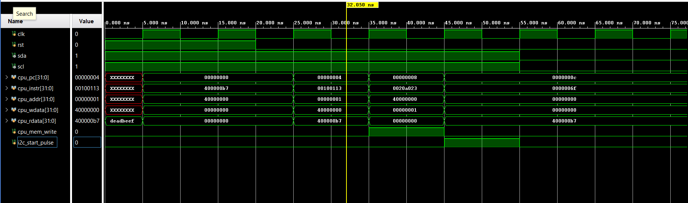

# RISC-V RV32I System-on-Chip (SoC)

A custom-built, single-cycle RISC-V RV32I System-on-Chip (SoC). This project features a modular RTL architecture with custom memory-mapped peripherals for I2C and DHT11 1-wire sensing, verified via hardware simulation.

## Architecture Overview
* **Processor Core:** Custom RV32I single-cycle datapath (Decode, Execute, Memory, Writeback).
* **Interconnect:** Memory-mapped bus architecture, mapping peripherals to the `0x4000_0000` memory space.
* **Peripherals:**
    * **I2C Master:** Logic-based controller for communication with external sensors.
    * **DHT11 Core:** Specialized 1-wire timing engine for temperature and humidity data acquisition.
* **Memory:** 16KB synchronous internal SRAM.

## Directory Structure
```text
/RTL
  /core        - RISC-V datapath and control logic
  /peripherals - I2C and DHT11 hardware state machines
/Test_bench    - Simulation environments for SoC and peripheral verification
program.txt    - Baked-in ROM machine code for hardware verification
```

## System Highlights
* **Memory-Mapped I/O:** The SoC communicates with all peripherals through a unified memory space, allowing the RISC-V core to trigger hardware events using standard `sw` (store word) instructions.
* **Protocol Engines:** Implemented hardware-level state machines for DHT11 (1-wire) and I2C protocols to handle microsecond-level timing.

## Verification
The design was verified through behavioral simulation in Vivado. The waveform below confirms the CPU's ability to trigger peripheral events:


*Figure: Waveform capturing the RISC-V core triggering the I2C peripheral via a memory-mapped store operation.*

## Future Work
* **Physical Synthesis:** Implementation and timing closure on a Basys 3 FPGA.
* **UART Integration:** Adding a UART transmission block for serial debugging.
* **Interrupt Controller:** Enabling event-driven peripheral management.

## Tools Used
* **HDL:** SystemVerilog
* **Simulation/Synthesis:** Xilinx Vivado
* **Target Architecture:** Basys 3